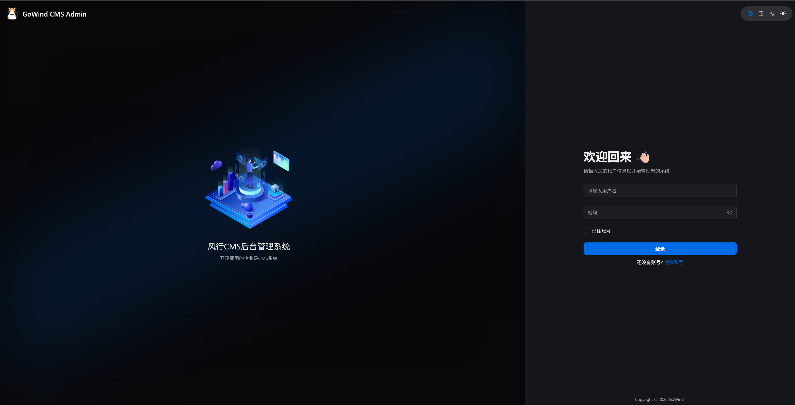
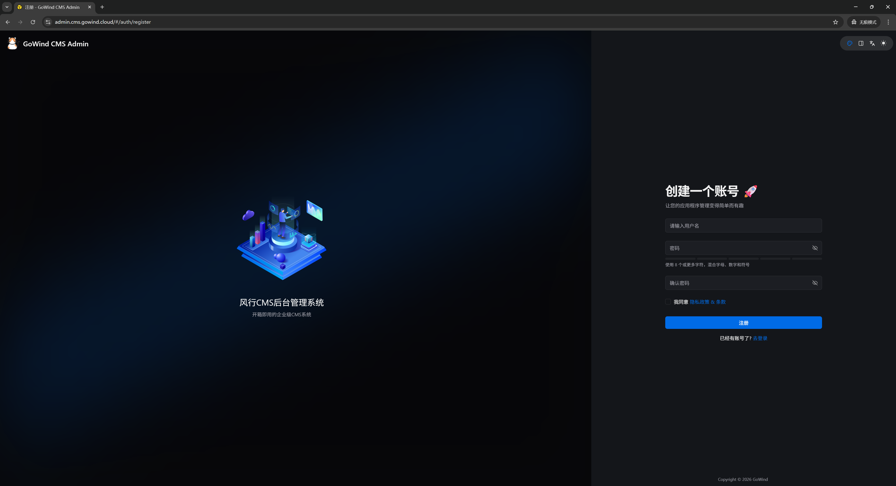
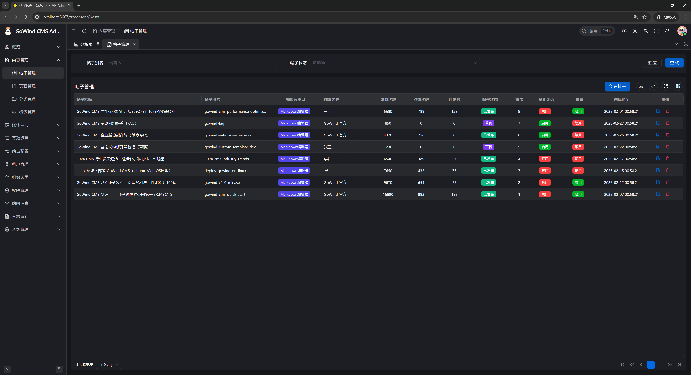
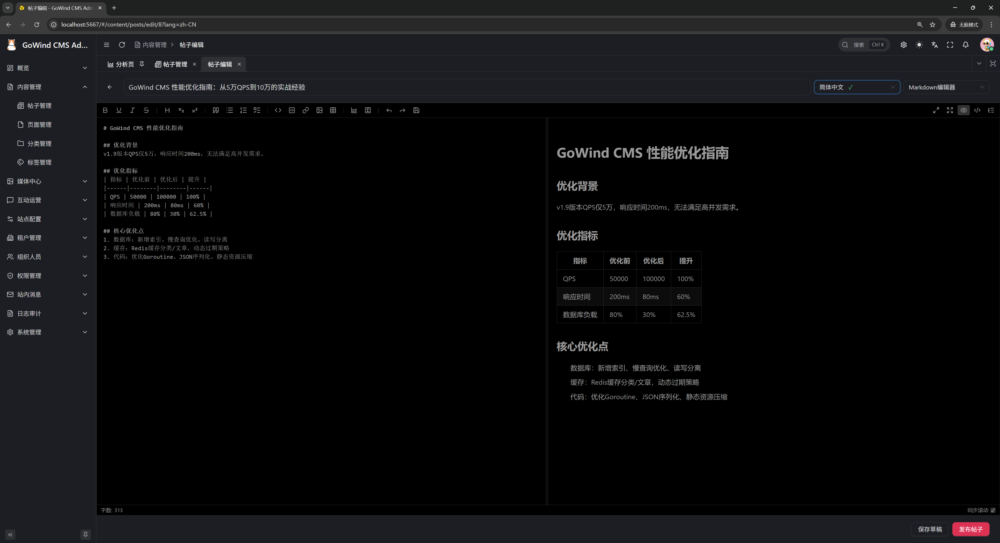
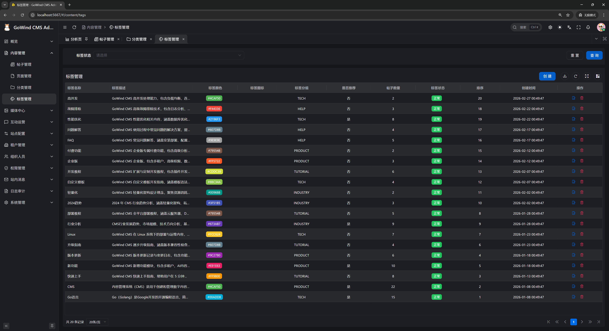
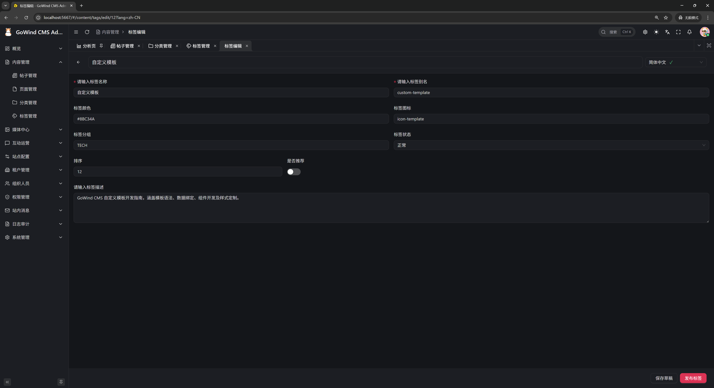
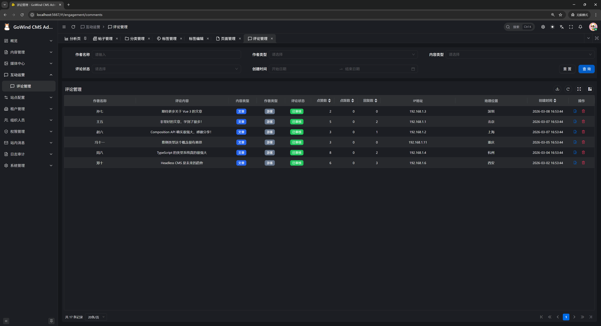
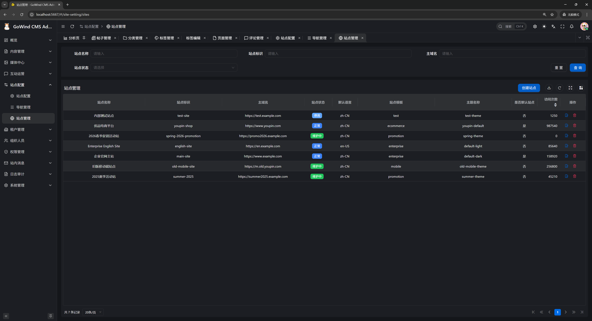
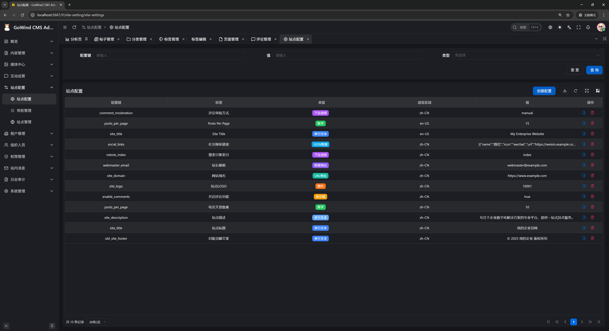

# GoWind Content Hub | FengXing, Out-of-the-Box Enterprise Integrated Frontend-Backend Content Platform

FengXing (GoWind HCH) is an out-of-the-box enterprise-grade Golang full-stack Headless Content Platform (HCH = Headless Content Hub), providing enterprises with flexible and scalable full-domain content management and distribution solutions.

**English** | [中文](./README.md) | [日本語](./README.ja-JP.md)

## Demo Addresses

| Demo Type | Access URL |
|---------------|--------------------------------------------------------------------------------------|
| Backend Admin Frontend | [https://admin.cms.gowind.cloud](https://admin.cms.gowind.cloud) |
| Backend API Swagger | [https://api.admin.cms.gowind.cloud/docs/](https://api.admin.cms.gowind.cloud/docs/) |
| Default Account/Password | `admin` / `admin` (applicable to all demo addresses) |
| Frontend API Swagger | [https://api.cms.gowind.cloud/docs/](https://api.cms.gowind.cloud/docs/) |
| Frontend Vue Site | [https://cms.gowind.cloud](https://cms.gowind.cloud) |
| Frontend React Site | [https://react.cms.gowind.cloud](https://react.cms.gowind.cloud) |
| Frontend Taro Site | [https://taro.cms.gowind.cloud](https://taro.cms.gowind.cloud) |

## FengXing · Core Technology Stack

Adhering to the philosophy of efficient, stable, and scalable technology selection, supporting multiple frontend technology stack adaptations, the system's core technology stack is as follows:

- Backend based on [Golang](https://go.dev/) + [go-kratos](https://go-kratos.dev/) + [wire](https://github.com/google/wire) + [ent](https://entgo.io/docs/getting-started/)
- Admin Frontend based on [Vue](https://vuejs.org/) + [TypeScript](https://www.typescriptlang.org/) + [Ant Design Vue](https://antdv.com/) + [Vben Admin](https://doc.vben.pro/)
- Frontend display supports multiple technology stacks, currently adapted for [Vue3](https://vuejs.org/) + [Naive UI](https://www.naiveui.com/), [React](https://react.dev/) + [Next.js](https://nextjs.org/) + [Ant Design](https://ant.design/), [Taro](https://docs.taro.zone/en/docs/).

## FengXing · Core Feature List

| Feature | Description |
|------|----------|
| Multi-tenant Management | Enterprise-level multi-tenant architecture, supporting tenant creation, enable/disable, package configuration and isolated management; new tenants automatically initialize departments, default roles and administrator accounts, support one-click login to tenant backend. |
| User Management | Full lifecycle management of system users, supporting user creation, editing, enable/disable, password reset; supports binding multiple roles, multiple departments and supervisors, can set/cancel supervisor status, supports one-click proxy login to designated users, supports advanced conditional queries. |
| Role Management | Unified management of roles and role groups, supports associating users by role, finely configuring menu permissions, interface permissions and data permissions; supports batch adding/removing employees, flexibly adapting to team permission division. |
| Permission Management | Unified management of permission groups, menu nodes and permission points, displaying permission system in tree structure, supports button-level fine-grained permission control, linked with interfaces and menus to achieve complete permission closed-loop. |
| Menu Management | Visually configure system menu directories, menu pages and function buttons, supports custom menu icons, sorting, routing and permission identifiers, frontend menus are automatically rendered dynamically according to permissions. |
| Department Management | Organizational structure department tree management, supports multi-level department creation, editing, sorting and linked binding with users, clearly dividing enterprise organizational hierarchy. |
| Content Modeling | Visual custom content models and field types, supporting text, numbers, rich text, images, files, associations and other fields, flexibly adapting to articles, products, announcements, materials and other business content structures. |
| Content Management | Unified management of various content data, supporting content creation, editing, publish/unpublish, pin, sort, recycle bin and batch operations; supports rich text/Markdown editing, one-click upload of images and attachments. |
| Category Management | Multi-level content category tree management, supporting category creation, editing, sorting, disabling, supports binding content models, frontend can quickly filter content by category. |
| Tag Management | Unified management of content tags, supporting tag creation, editing, deletion and association with content, supports search and aggregation display by tags. |
| Comment Management | Manage user comments and interaction content, supports viewing, auditing, deleting, replying, blocking违规 comments, can filter and query by content, user, time. |
| Multi-language Management | Native multi-language internationalization support, supporting language creation, enable/disable, unified translation management of content, menus, prompt messages, seamlessly supporting overseas and cross-border business. |
| Site Management | Supports independent configuration of multiple sites, each tenant can create multiple sites, independently configure domain names, titles, logos, SEO information and display styles. |
| Site Configuration | Visual site system configuration, supporting basic information, SEO optimization, upload limits, cache policies, email/SMS and other global parameter configuration, configuration takes effect in real-time. |
| File Resource Management | Unified management of file resources such as images, documents, videos, supports uploading to local or OSS cloud storage, supports file preview, copy address, download, delete, group management and large image view. |
| Dictionary Management | System data dictionary major categories and sub-items management, supports linked queries, server-side sorting, import/export, used for maintaining global common data such as dropdown options, status identifiers. |
| Interface Management | Unified maintenance and automatic synchronization of backend interfaces, supports displaying interface list in tree structure, configurable interface request parameters, response results and operation log records, used for permission point binding. |
| Task Scheduling | Scheduled task management, supporting task creation, editing, deletion, start, pause, immediate execution, view task execution records and operation logs, ensuring automatic operation of scheduled business. |
| Message Notification | Message classification and push management, supports multi-level message classification, can send messages to designated users, view message read status and read time. |
| Internal Messages | Personal internal message center, supports message viewing, deletion, marking single message as read, one-click mark all as read, achieving message delivery between system and users. |
| Personal Center | Personal information viewing and editing, avatar, nickname modification, login password reset, view login records and account security information. |
| Cache Management | System cache real-time query and management, supports precise clearing by cache key, batch cleanup, ensuring system configuration and data real-time updates. |
| Login Logs | Record all user login success/failure logs, including login account, IP, location, device, time, supports query and export, convenient for security audit. |
| Operation Logs | Full-link user operation log recording, including normal and abnormal operations, recording operator, IP, location, request parameters and results, supports detail viewing and tracing. |
| Headless API | API-first design, providing complete frontend-backend OpenAPI interfaces, supporting content query, creation, update, deletion, adapting to Vue, React, Taro, mini-program and other multi-terminal calls. |

## FengXing · Backend Screenshots

<table>
    <tr>
        <td></td>
        <td></td>
    </tr>
    <tr>
        <td></td>
        <td></td>
    </tr>
    <tr>
        <td></td>
        <td></td>
    </tr>
    <tr>
        <td></td>
        <td></td>
    </tr>
    <tr>
        <td></td>
        <td></td>
    </tr>
    <tr>
        <td></td>
    </tr>
</table>

## FengXing · Frontend Screenshots

<table>
    <tr>
        <td></td>
        <td></td>
    </tr>
    <tr>
        <td></td>
        <td></td>
    </tr>
    <tr>
        <td></td>
        <td></td>
    </tr>
    <tr>
        <td></td>
        <td></td>
    </tr>
    <tr>
        <td></td>
        <td></td>
    </tr>
</table>

## Contact Us

- WeChat Personal Account: `yang_lin_bo` (Note: `go-wind-cms`)
- Juejin Column: [go-wind-cms](https://juejin.cn/column/7541283508041826367)

## [Thanks to JetBrains for providing free GoLand & WebStorm](https://jb.gg/OpenSource)

