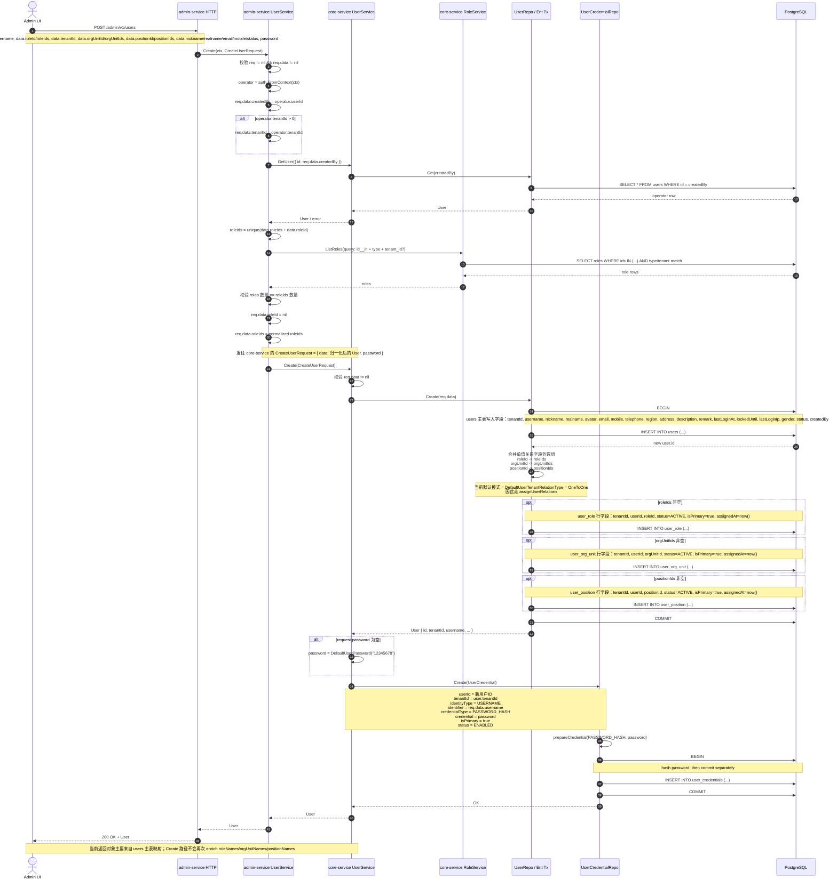

# CreateUser 调用链与字段级泳道图

本文按一次真实的 `CreateUser` 请求顺序，拆解管理端创建用户时从 HTTP 入口到 `admin-service`、`core-service`、数据库落库的完整链路，并补到字段级。

## 1. 入口与参与方

- HTTP 入口：`POST /admin/v1/users`
- 绑定请求类型：`identity.service.v1.CreateUserRequest`
- 请求结构：
  - `data: User`
  - `password: string`

本次泳道图按以下参与方展开：

- `Admin UI`
- `admin-service HTTP`
- `admin-service UserService`
- `core-service UserService`
- `core-service RoleService`
- `UserRepo / Ent Tx`
- `UserCredentialRepo`
- `PostgreSQL`

## 2. 请求体关键字段

最关键的输入字段不是 `User` 的全部字段，而是创建链路里真正影响控制流和落库结果的这些：

```json
{
  "data": {
    "tenantId": 100,
    "orgUnitId": 200,
    "orgUnitIds": [200, 201],
    "positionId": 300,
    "positionIds": [300, 301],
    "roleId": 400,
    "roleIds": [400, 401],
    "username": "alice",
    "nickname": "Alice",
    "realname": "Alice Zhang",
    "email": "alice@example.com",
    "mobile": "13800000000",
    "status": "NORMAL"
  },
  "password": "plain-text-from-request"
}
```

## 3. 主路径泳道图



## 4. 字段流转表

### 4.1 `admin-service` 会补写或归一化的字段

| 字段 | 来源 | 处理方式 |
| --- | --- | --- |
| `data.createdBy` | 上下文 `operator.userId` | 强制补写 |
| `data.tenantId` | 上下文 `operator.tenantId` | 当操作人带租户时覆盖请求值 |
| `data.roleId` | 请求体 | 仅作兼容输入，后续被清空 |
| `data.roleIds` | 请求体 + `roleId` | 合并、去重、校验后作为最终角色数组 |

### 4.2 `core-service` 写入 `users` 主表的字段

| 字段组 | 实际写入 |
| --- | --- |
| 身份基础字段 | `tenantId`, `username`, `nickname`, `realname`, `avatar` |
| 联系方式 | `email`, `mobile`, `telephone` |
| 个人资料 | `region`, `address`, `description`, `remark`, `gender` |
| 安全与状态 | `status`, `lockedUntil`, `lastLoginAt`, `lastLoginIp` |
| 审计字段 | `createdBy`, `createdAt` |

### 4.3 `core-service` 不直接写入 `users` 主表、而是分表写入的字段

| 字段 | 落库位置 | 说明 |
| --- | --- | --- |
| `roleId`, `roleIds` | `user_role` | 单值先并入数组，再逐条插入 |
| `orgUnitId`, `orgUnitIds` | `user_org_unit` | 单值先并入数组，再逐条插入 |
| `positionId`, `positionIds` | `user_position` | 单值先并入数组，再逐条插入 |
| `password` | `user_credential` | 不进入 `User` 主表，单独存凭证表 |

## 5. 短路点与失败点

在进入真正创建之前，链路会在这些位置直接失败：

- `req == nil` 或 `req.data == nil`
- `auth.FromContext(ctx)` 失败，拿不到当前操作人
- `createdBy` 对应操作人不存在
- `roleIds` 为空
- 角色查询结果数量和请求角色数不一致
- `users` 主表插入失败
- 关系表写入失败
- `user_credential` 写入失败

## 6. 一个实现细节

当前实现中，用户主数据和凭证不是同一个数据库事务：
- `userRepo.Create(req.data)` 自己开启并提交事务
- 返回用户主表数据后，`core-service` 才调用 `userCredentialRepo.Create(...)`
- `userCredentialRepo.Create(...)` 再开启第二个事务

这意味着：

- 如果凭证创建失败，`users` 主表和关系表可能已经提交成功
- 当前链路是“先创建用户，再创建凭证”，而不是单事务原子创建

## 7. 代码定位

- HTTP 路由绑定：[backend/api/gen/go/admin/service/v1/i_user_http.pb.go](/C:/Users/WIN10/GolandProjects/go-wind-cms/backend/api/gen/go/admin/service/v1/i_user_http.pb.go)
- `admin-service` 预处理：[backend/app/admin/service/internal/service/user_service.go](/C:/Users/WIN10/GolandProjects/go-wind-cms/backend/app/admin/service/internal/service/user_service.go)
- `core-service` 创建逻辑：[backend/app/core/service/internal/service/user_service.go](/C:/Users/WIN10/GolandProjects/go-wind-cms/backend/app/core/service/internal/service/user_service.go)
- 用户主表与关系表写入：[backend/app/core/service/internal/data/user_repo.go](/C:/Users/WIN10/GolandProjects/go-wind-cms/backend/app/core/service/internal/data/user_repo.go)
- 凭证写入：[backend/app/core/service/internal/data/user_credential_repo.go](/C:/Users/WIN10/GolandProjects/go-wind-cms/backend/app/core/service/internal/data/user_credential_repo.go)
