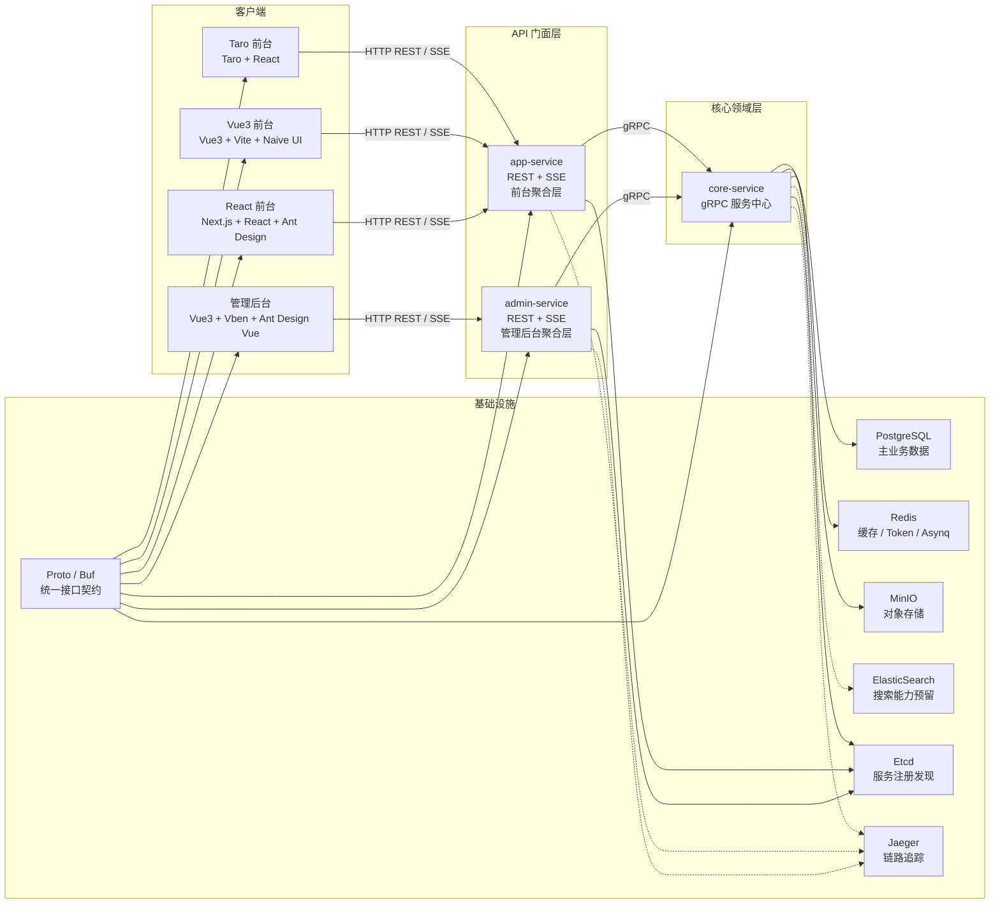

# GoWind CMS 项目结构与架构分析

本文基于仓库当前代码、配置与装配关系整理，重点回答三个问题：

- 项目按什么层次组织
- 系统用了哪些关键组件
- 服务之间如何调用

相关链路文档：

- [CreateUser 调用链与字段级泳道图](./create-user-sequence.md)

## 1. 项目总览

GoWind CMS 不是一个简单的单体应用，也不是完全拆散的微服务群。按代码装配关系看，它更接近下面这种结构：

- `frontend`：多个面向不同场景的前端应用
- `backend/app/admin/service`：管理后台 API 门面
- `backend/app/app/service`：前台站点 API 门面
- `backend/app/core/service`：核心领域服务与数据拥有者
- `backend/api/protos`：统一接口契约源
- `backend/api/gen` 与各前端 `generated` 目录：由 proto 生成的服务端/客户端代码

可以把它理解成：

- `admin-service` 和 `app-service` 面向不同客户端提供 HTTP API
- 它们自己不直接持有主要业务数据
- 大部分业务能力最终都下沉到 `core-service`
- `core-service` 直接连接数据库、缓存、对象存储和任务组件

## 2. 目录结构

```text
go-wind-cms/
├─ backend/
│  ├─ api/
│  │  ├─ protos/                  # Proto 接口定义
│  │  ├─ gen/                     # 生成的 Go 代码
│  │  ├─ buf.gen.yaml             # Go 代码生成
│  │  ├─ buf.admin.typescript.gen.yaml
│  │  ├─ buf.react.app.typescript.gen.yaml
│  │  ├─ buf.vue3.app.typescript.gen.yaml
│  │  └─ buf.taro.app.typescript.gen.yaml
│  ├─ app/
│  │  ├─ admin/service/           # 管理后台 API 聚合层
│  │  ├─ app/service/             # 前台 API 聚合层
│  │  └─ core/service/            # 核心领域服务
│  ├─ docker-compose.yaml         # 完整运行依赖与服务编排
│  └─ docker-compose.libs.yaml    # 基础中间件编排
├─ frontend/
│  ├─ admin/                      # Vue3 管理后台
│  └─ app/
│     ├─ react/                   # Next.js / React 前台
│     ├─ vue3/                    # Vue3 / Vite 前台
│     └─ taro/                    # Taro / React 多端前台
└─ docs/
   └─ images/                     # README 截图资源
```

## 3. 技术栈与关键组件

### 后端

- 语言与框架：Golang、Kratos、Wire
- 数据访问：Ent ORM
- 接口定义：Protobuf、Buf、OpenAPI
- 服务间通信：gRPC
- 对外协议：HTTP REST、SSE
- 服务注册与发现：Etcd
- 可观测性：OpenTelemetry / Jaeger
- 缓存与令牌：Redis
- 关系型数据库：PostgreSQL
- 对象存储：MinIO
- 搜索能力预留：ElasticSearch
- 异步任务：Asynq + Redis

### 前端

- 管理端：Vue 3、TypeScript、Ant Design Vue、Vben
- React 前台：Next.js、React、Ant Design
- Vue3 前台：Vue 3、Vite、Naive UI
- Taro 前台：Taro、React

## 4. 三个后端服务的职责划分

### `core-service`

核心领域服务，主要职责是：

- 承载用户、租户、组织、角色、权限、菜单、API 资源
- 承载内容域：文章、分类、标签、页面、评论
- 承载站点域：站点、站点设置、导航、导航项
- 承载字典、多语言、审计日志、站内消息、媒体资源、文件元数据
- 负责认证核心能力、令牌缓存、数据落库、对象存储接入、任务调度

它是系统的主要数据拥有者，也是其它服务的 gRPC 供给方。

### `admin-service`

管理后台 API 门面，主要职责是：

- 向管理端前端暴露 REST API 和 SSE
- 聚合 `core-service` 的 gRPC 能力
- 处理后台鉴权、权限校验、菜单路由拼装
- 负责后台的文件上传、媒体管理、消息推送、审计查询等面向管理端的交互层逻辑

### `app-service`

前台 API 门面，主要职责是：

- 向网站端和多端应用暴露 REST API 和 SSE
- 聚合 `core-service` 的 gRPC 能力
- 提供登录、用户资料、导航、内容浏览、评论、文件传输等前台能力

## 5. 系统级架构图



## 6. 模块级调用图

```mermaid
flowchart TB
    subgraph AdminSide["admin-service 管理后台聚合层"]
        AdminAuth["认证与登录策略"]
        AdminUser["用户 / 租户 / 组织 / 岗位 / 角色"]
        AdminPerm["菜单 / API / 权限 / 后台路由"]
        AdminOps["任务 / 字典 / 语言"]
        AdminContent["文章 / 分类 / 标签 / 页面 / 评论"]
        AdminSite["站点 / 站点设置 / 导航"]
        AdminFile["文件 / 媒体资源 / 上传"]
        AdminAudit["登录 / API / 操作 / 权限 / 数据审计"]
        AdminMsg["站内消息 / SSE 推送"]
        AdminTranslate["翻译服务"]
    end

    subgraph AppSide["app-service 前台聚合层"]
        AppAuth["认证"]
        AppProfile["用户资料"]
        AppNav["导航"]
        AppContent["文章 / 分类 / 标签 / 页面"]
        AppComment["评论"]
        AppFile["文件传输"]
    end

    subgraph CoreSide["core-service 核心领域服务"]
        CoreAuth["Authentication / LoginPolicy"]
        CoreIdentity["User / Tenant / OrgUnit / Position"]
        CoreAcl["Role / Permission / Menu / API"]
        CoreTask["Task"]
        CoreDict["Dict / Language"]
        CoreContent["Post / Category / Tag / Page / Comment"]
        CoreSite["Site / SiteSetting / Navigation"]
        CoreStorage["File / MediaAsset / MinIO"]
        CoreAudit["Audit Logs"]
        CoreMsg["InternalMessage"]
        CoreData["Ent Repository / PostgreSQL"]
        CoreCache["Redis / Token Cache / Asynq"]
    end

    AdminAuth --> CoreAuth
    AdminUser --> CoreIdentity
    AdminUser --> CoreAcl
    AdminPerm --> CoreAcl
    AdminOps --> CoreTask
    AdminOps --> CoreDict
    AdminContent --> CoreContent
    AdminSite --> CoreSite
    AdminFile --> CoreStorage
    AdminAudit --> CoreAudit
    AdminMsg --> CoreMsg

    AppAuth --> CoreAuth
    AppProfile --> CoreIdentity
    AppProfile --> CoreAcl
    AppNav --> CoreSite
    AppContent --> CoreContent
    AppComment --> CoreContent
    AppFile --> CoreStorage

    CoreAuth --> CoreCache
    CoreStorage --> CoreData
    CoreContent --> CoreData
    CoreSite --> CoreData
    CoreIdentity --> CoreData
    CoreAcl --> CoreData
    CoreTask --> CoreData
    CoreDict --> CoreData
    CoreAudit --> CoreData
    CoreMsg --> CoreData
    CoreStorage --> MinIO["MinIO"]
    CoreData --> PG["PostgreSQL"]
    CoreCache --> Redis["Redis"]
```



## 7. 服务调用关系说明

### 7.1 客户端到服务

- 管理后台前端只调用 `admin-service`
- React / Vue3 / Taro 前台统一调用 `app-service`
- 两个 API 门面都提供 REST，对实时消息场景提供 SSE

### 7.2 服务到服务

- `admin-service` 通过 gRPC 调用 `core-service`
- `app-service` 通过 gRPC 调用 `core-service`
- 三个服务通过 Etcd 做注册与发现

### 7.3 核心服务到基础设施

- `core-service -> PostgreSQL`：主业务数据持久化
- `core-service -> Redis`：缓存、令牌、异步任务
- `core-service -> MinIO`：文件与媒体对象存储
- `core-service -> ElasticSearch`：搜索相关能力预留
- `core-service -> Jaeger`：链路追踪上报

## 8. 接口契约与代码生成链路

本项目的接口契约是统一维护的，而不是每个服务手写一套 API：

1. 在 `backend/api/protos` 中维护 proto 定义
2. 用 Buf 生成 Go gRPC/HTTP/OpenAPI 代码到 `backend/api/gen`
3. 同时生成前端 TypeScript SDK

当前可见的生成结果包括：

- `frontend/admin/apps/admin/src/generated/api/admin/service/v1/index.ts`
- `frontend/app/react/src/api/generated/app/service/v1/index.ts`
- `frontend/app/vue3/src/api/generated/app/service/v1/index.ts`
- `frontend/app/taro/src/api/generated/app/service/v1/index.ts`

这条链路的价值是：

- 后端接口定义统一
- 前端 SDK 与接口契约同步
- OpenAPI 文档可由 proto 直接派生

## 9. 关键结论

- 架构中心不是 `admin-service` 或 `app-service`，而是 `core-service`
- `admin-service` 与 `app-service` 更像面向不同客户端的 API 聚合层
- 系统采用“统一契约 + 多前端 + 核心领域服务”的组织方式
- 业务扩展优先落在 `core-service`，客户端体验和聚合逻辑再分别落在 `admin-service` / `app-service`
- 从维护角度看，最重要的依赖链是：前端 -> API 门面层 -> `core-service` -> 数据与基础设施
